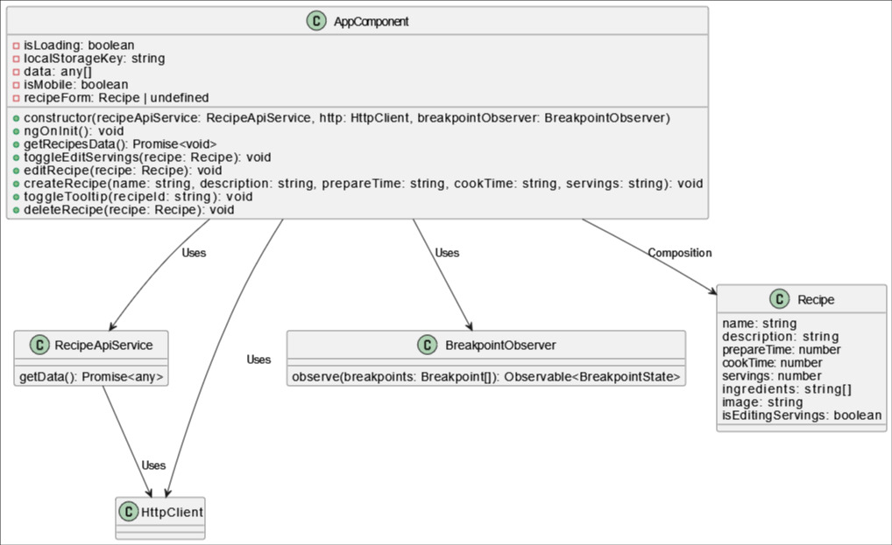

# Aplicación de Gestión de Recetas

## Descripción

Esta aplicación te permite gestionar tus recetas de manera efectiva. Te permite ver, crear, editar y eliminar recetas. Los datos se obtienen de una API de recetas y también proporciona capacidades sin conexión almacenando las recetas localmente usando Local Storage.

## Funcionalidades

- Ver recetas con detalles como nombre, descripción, tiempo de preparación, tiempo de cocción y porciones.
- Crear nuevas recetas proporcionando la información necesaria.
- Editar recetas existentes para actualizar sus detalles.
- Eliminar recetas que ya no necesitas.
- Pistas emergentes para obtener información adicional sobre las recetas.
- Diseño adaptable para usuarios de dispositivos móviles y de escritorio.

# Instalación de dependencias:

Instala las dependencias ejecutando `npm install`.

# Uso:

Para iniciar el servidor de desarrollo, utiliza `ng serve`.

# Uso de ng serve

Abre tu navegador y navega a [http://localhost:4200/](http://localhost:4200/) para ver la aplicación.

# Configuración

## Clave de API de Recetas

Para obtener datos de recetas desde la API externa, necesitas obtener una clave de API de la plataforma RapidAPI. Una vez que tengas la clave de la API, reemplaza el marcador de posición `TU_CLAVE_DE_API` en el archivo `environment.ts` con tu clave de API real:

export const environment = {
  production: false,
  apiKey: 'API_PASS'
};

## Variables de Entorno

Para datos o configuraciones más sensibles, puedes usar variables de entorno. Crea un archivo `.env` en el directorio raíz de tu proyecto y agrega tus variables específicas del entorno. Por ejemplo:

API_KEY=API_PASS

Luego, puedes acceder a estas variables de entorno en tu aplicación Angular usando el objeto `process.env`.

## Local Storage

La aplicación utiliza Local Storage para persistir los datos de las recetas localmente en el navegador. Esto permite a los usuarios acceder a sus recetas incluso cuando están sin conexión. Los datos se almacenan bajo la clave especificada en la propiedad `localStorageKey` del `AppComponent`.

## Servicio de API de Recetas

El `RecipeApiService` es responsable de obtener los datos de recetas de la API externa. Utiliza la plataforma RapidAPI para realizar solicitudes HTTP al endpoint de la API de recetas. Si la solicitud falla o encuentra un error, utiliza datos simulados almacenados localmente como respaldo.

## Código

Francisco Harris Bianchi
